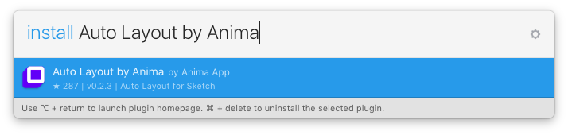

## 📐 Responsive Design for Sketch
.gif)

Auto-Layout is a plugin for Sketch that enables designers to design fully responsive artboards.

### ☝️ Features

* 📍 Pins (Constraints) - [Learn more](https://animaapp.github.io/docs/v1/guide/03-pins.html)
* 🗄 Stacks (Flexbox) - [Learn more](https://animaapp.github.io/docs/v1/guide/12-stacks-flexbox.html)
* ⚡️ Updates in real time when dragging layers
* 🖥 Easily generate an overview of all screen sizes
* 💎 Supports Symbols
* 📱 Supports Web/iOS/Android
* ↔️ Breakpoints (media queries) (coming soon)

### 📺 Videos

* 📍 Pins [Watch](https://www.youtube.com/watch?v=v393LgriWCs)
* 🗄 Stacks (Flexbox) [Watch](https://www.youtube.com/watch?v=DiCXg17CwIY)

### 📝 Blog posts

* 📐 Auto-Layout [Read](https://medium.com/sketch-app-sources/introducing-auto-layout-for-sketch-24e7b5d068f9)
* 🗄 Stacks (Flexbox) [Read](https://medium.com/sketch-app-sources/auto-layout-introducing-stacks-flexbox-for-sketch-c8a11422c7b5#.dj57nqyh3)

### 🏃🏼 Install with Sketch Runner
* With Sketch Runner, just go to the `install` command and search for `Auto Layout`. Runner allows you to manage plugins and do much more to speed up your workflow in Sketch. [Download Runner here](http://www.sketchrunner.com).

### Installation via [Sketch Plugin Manager](https://mludowise.github.io/Sketch-Plugin-Manager/):

1. In the 'Catalog' tab of the Sketch Plugin Manager window, click in the 'Search' field and type 'Auto Layout', to filter the list.
2. You will see the 'Auto Layout' plugin listed at the top of the list. Click the 'Instal' button inside it.

# 📖 Documentation

* 🔗 [Documentation Website](https://animaapp.github.io/docs/v1/guide/)

## Pins

### Simple 

Simple pinning allows to pin a layer to its parent with the following:

* Top
* Right
* Bottom
* Left
* Center Horizontally
* Center Vertically

When selecting a pin, Auto-Layout will set the pin constant value as the current pixel value.  

*For example if a layer is 20px from the right and you select `Pin to Right`, the `right` pin constant value will be set to 20px.*

Once a pin is set, Auto-Layout will enforce the pin value when the artboard is resized.  

*For example if you pinned a layer to the right by 20px, you can resize the artboard by dragging its right side and you'll notice the layer always stays 20px from the right.*

### Pin to Parent

* A `Layer` is always pinned to its `Parent`
* A parent can be either an `Artboard` or a `Group`
* Pinning betweein siblins can be achieved using `Stacks`

`Layer` in an `Artboard`

`Layer` in a `Group`

### Advanced 

* To reveal the advanced pinning panel click `Pins`
* You can pin a layer either by `pixels` or by `percent`.
* `Pixels` values are in the left text boxes, `Percent` values are in the right text boxes.
* Use the `Toggle` button to select which type of pinning.

### Pinning by Pixels

### Pinning by Percent

## Size

### Width & Height

You can set a `Layer` `width` and `height` by checking the `width` and `height` checkboxes.  
When you check the `width` or `height` box, Auto-Layout will set the current value as the constraint value.
The taken value will be either by `pixels` or by `percent`, depending on the current toggle state.

### Min & Max 

You can set the `miniumum` or `maximum` value of the `width` or the `height` of a `Layer`  

Once set, the layer `width` or `height` will never exceed the min/max values, no matter what the `Artboard` size is.

**To keep the layer pinned to the left rather from the right, set the width to % and uncheck `Right` pin.**

### Custom Height

In some cases you want to extend the height of an artboard further than the default platform screen sizes, in order to show how the design looks when the user scrolls down.

Auto-Layout will automatically recognize artboards that do not have default screen sizes and will never decrease their height to less than their original height.

## Center

- **A centered `Layer` is always centered to its `Parent`** 
- **A parent can be either an `Artboard` or a `Group`**

### Center Horizontally

You can center a layer horizontally to its parent.

### Center Vertically

You can center a layer vertically to its parent.

## Stacks

### What is a Stack?

A Stack is a special type of Group that defines the layout of its child Layers.

> A Stack Group icon has a special Blue color and an indicator of its Direction.

### How to Stack?

To Stack layers  or groups, select them and click the Stack button in Auto-Layout panel.

### Stack Properties

A Stack has 3 properties:

1. Direction: Defines if stacking of child Layers is Horizontal or Vertical.
2. Alignment: Can be Top/Center/Bottom/Spread
3. Spacing: Defines the spacing between each child Layer.

### Direction

Defines if stacking of child Layers is Horizontal or Vertical.

### Alignment

Can be Top/Center/Bottom/Spread

### Spacing

Defines the spacing between each child Layer.

### Stack Nesting

> Stacks can be nested

### Examples

### Scaling Text Background 

[Sketch file](http://bit.ly/2lJ4luf)

### Tutorials

[Walkthrough Video (29:09)](https://www.youtube.com/watch?v=DiCXg17CwIY) by Pablo Stanley

---

[Walkthrough Video (7:36)](https://designers.how/episodes/use-auto-layout-to-be-more-effective) by Chris Slowik

---

[Flex Grid Video (25:25)](https://www.youtube.com/watch?v=g--AD_Yp5lk)

---

[Dynamic Buttons Blog Post](https://medium.com/@giuse/overrides-dynamic-buttons-in-sketch-c9ccfb6a5682#.v4widi6sc) by Giusè

---

## Orientation

You can toggle all artboards by clicking the `Orientation` toggle button.

 
## Presets

Presets are pre-defined `Artboard` sizes of real world screen sizes devices.  
Once you've defined Auto-Layout on your design, you can easily change `Artboard` sizes to these presets.

### iOS

|   Device  |   Width  |   Height  | Scale |
|:---------:|:--------:|:---------:|:-----:|
| iPhone 4  |  320     |   480     |   2   |
| iPhone SE |  320     |   568     |   2   |
| iPhone 7  |  375     |   667     |   2   |
| iPhone 7+ |  414     |   736     |   3   |
| iPad Air  |  768     |   1024    |   2   |
| iPad Pro  |  1024    |   1366    |   2   |

> ** `Scale` means that the number of pixels is multiplied according to the scale value.**
  * For example in iPhone 7 the screen size is 375x667 points, but 750x1334 actual pixels since Scale is 2.

### Android

|   Device          |   Width  |   Height  |
|:-----------------:|:--------:|:---------:|
| Android Phone     |  360     |   640     |
| Android Tablet 7' |  600     |   960     |
| Android Tablet 9' |  768     |   1024    |
| Android Desktop   |  1280    |   850     |

### Web

|   Device         |   Width  |   Height  |
|:----------------:|:--------:|:---------:|
| Desktop HD       |  1440    |   1024    |
| Desktop          |  1024    |   1024    |
| Tablet Portrait  |  768     |   1024    |
| Mobile Portrait  |  320     |   1024    |

### Custom

### Presets Editor

The Plugin comes with a default collection of presets mentioned above. However you can easily add, edit, import and export your own presets.  

### Import

1. Click “Platform” -> “Custom”
2. The “Presets Editor” shows up, click “Import”
3. Navigate and select the collection json file
4. Done!

### Export 

So you’ve made the effort to create a perfect collection of presets and now your colleagues are jealous. Lucky enough you can become the hero of the day by just exporting your collection and sharing it with them.

## Keyboard Shortcuts

Present `Keyboard Shortcuts` settings

You can use the `Default` shortcuts or assign your own.

